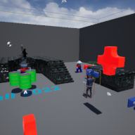

# Project Name  Fall22

## Description

A github repository for the in class demonstrations.   
Some audio assets from opengameart.org   https://opengameart.org  

Notes:
1 - hdri images from polyhaven.com
2 - some audio from bensound

Bugs
- re UE bug, audio does not play some iPad model's builtin speakers, but does play on headsets
- re UE bug, (if implemented) background blur in HUD does not work on most Android devices

## Usage
Clone, or download the zip, to a local directory. Open in Unreal Engine 4.27 or newer

